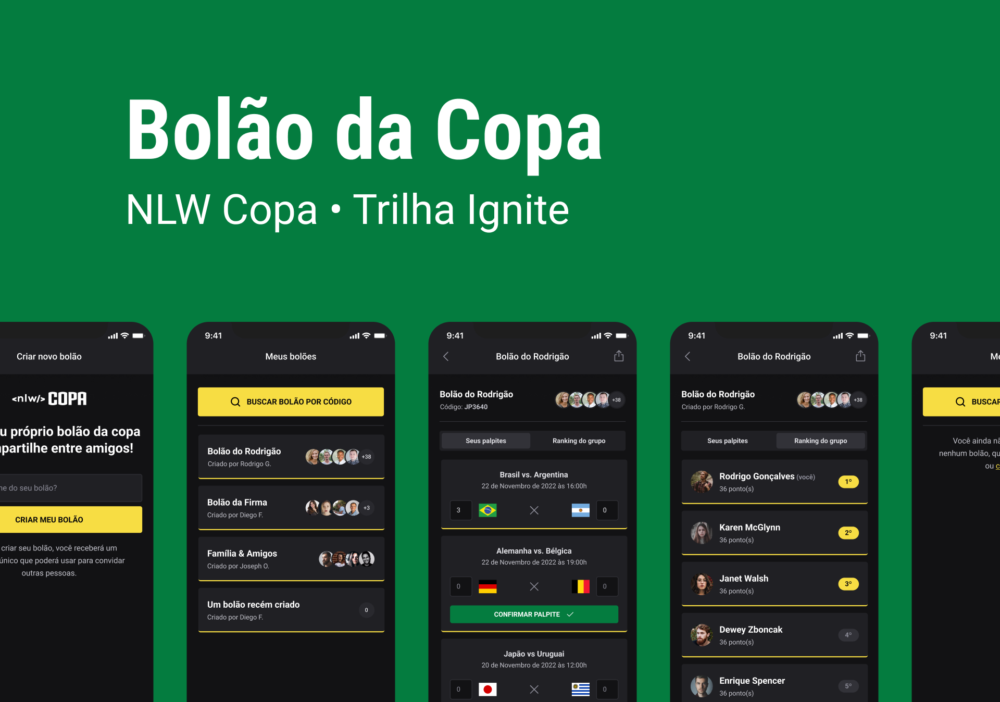

<h1 align="center"></h1>



## 📝 Descrição
Este projeto foi desenvolvido durante o evento da Rocketseat, a ideia do projeto é criar um aplicativo de bolões, onde os usuários podem criar bolões com seus amigos e salvar suas apostas.

## 📚 Funcionalidades
* <b>Criar bolão</b>: Qualquer usuário pode criar um bolão, tanto no aplicativo quanto na web.

* <b>Visualizar os bolões criados</b>: O usuário poderá ver os bolões que ele criou e os que ele participa.

* <b>Buscar bolão</b>: Buscar bolão pelo código.

* <b>Detalhes do bolão</b>: Os usuários podem escolher um bolão e visualizar os jogos desse bolão, e os palpites caso tenha, e criar um palpite caso ainda não tenha feito um palpite.

## 🔧 Tecnologias utilizadas
* NextJS;
* React Native;
* Node;
* Prisma;
* Typescript;
* HTML;
* Tailwind CSS;

## 🚀 Rodando o projeto


1. Clone o repositório
   ```sh
   https://github.com/marcospaulo12345/nlw-copa.git
   ```
2. Install NPM packages on server, web and mobile
   ```sh
   npm install
   ```

3. run aplication web
   ```sh
   npm run dev
   ```
   
4. run aplication mobile
   ```sh
   expo start
   ```
   
3. run server
   ```sh
   prisma migrate dev --name init
   ```
   
   ```sh
   npx prisma db seed
   ```
   
   ```sh
   npm run dev
   ```

## 🔜 Implementação futura
* Implementar um Ranking em cada bolão.
* Implementar o login de usuário na versão web.


## 🎯 Status do projeto

* Em andamento...
